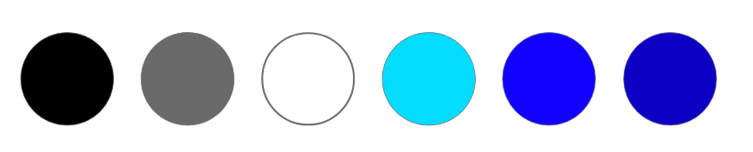

# Cours 8
## Création de palette de couleur

## Choix d'un thème 
Explorer les thèmes dans l'outil de présentation numérique de votre choix. Choississez 3 thèmes que vous aimez bien et notez les dans votre journal. Vous pouvez aussi insérer des images de ces thèmes. 

#### Outil de présentation:    
Thème 1 | Thème 2 | Thème 3
--| -- | --
Secteur  | Concis | Céleste
