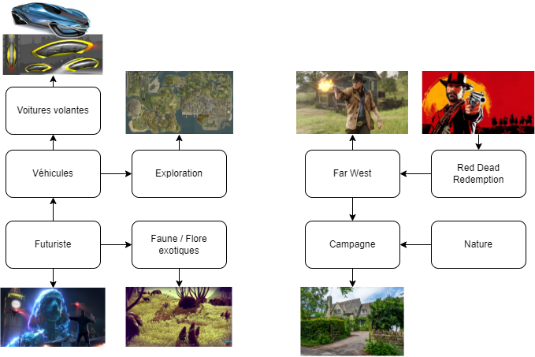

# Cours 13
## Préparation de la présentation 3 
Notre projet serait un jeu vidéo de style "rpg" à monde ouvert afin de rester das le memee style de Rockstar Games. Red Dead redemption se passe durant l'époque cowboy, Grand Theft Auto temps morderne, alors on a choisi une ambiance futuristique. Le joueur pourra se promener autant qu'il le veut sur la carte et il devra terminer la quête principale de l'histoire. Des quêtes secondaires seront aussi dans le jeu afin de rajouté du contenu et du temps de jeu.

